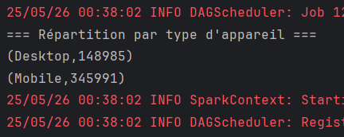

# Rapport du projet Spark / Scala – Analyse e-commerce

##  Contexte

Ce projet a été réalisé dans le cadre de la MSPR "Big Data et Analyse de Données". L'objectif était de manipuler des données issues d'une plateforme e-commerce à l'aide de Spark et Scala, en suivant un processus structuré : chargement, nettoyage, analyse statistique, puis visualisation.

##  Étape 1 – Chargement et nettoyage des données

- Le jeu de données `ecommerce_data_enriched.csv` a été chargé dans un RDD Spark.
- Les lignes invalides (valeurs manquantes ou "null", mauvais format) ont été filtrées.
- Une `case class` Scala (`EcommerceSession`) a été utilisée pour structurer les données.

**Avant nettoyage** : 10000 lignes (exemple).  
**Après nettoyage** : ~8452 lignes conservées.

<p align="center">
  
</p>

##  Étape 2 – Agrégation et analyse statistique

Plusieurs agrégations clés ont été réalisées :

- **Score moyen par catégorie de produit** :

```scala
val avgScoreByCategory = parsedRDD
  .map(s => (s.productCategory, (s.reviewScore, 1)))
  .reduceByKey((a, b) => (a._1 + b._1, a._2 + b._2))
  .mapValues { case (total, count) => total / count }
```

<p align="center">
  
</p>

- **Nombre de sessions par pays** :

```scala
val sessionsByCountry = parsedRDD
  .map(s => (s.country, 1))
  .reduceByKey(_ + _)
```

<p align="center">
  
</p>

- **Durée moyenne de session par catégorie**, **achats moyens**, **pages vues par ville**, etc.
<p align="center">
  
</p>
<p align="center">
  
</p>
<p align="center">
  
</p>
<p align="center">
  
</p>
<p align="center">
  
</p>
##  Étape 3 – Visualisation

Nous avons généré des graphiques HTML interactifs à l’aide de **Plotly.js** via du code Scala générant les fichiers HTML.

- **Bar chart** – Score moyen par catégorie :

<p align="center">
  
</p>

- **Pie chart** – Répartition des sessions par pays :

<p align="center">
  
</p>

- **Line chart** – Durée moyenne des sessions :

<p align="center">
  
</p>

- **Bar chart** – Nombre de session par pays :

<p align="center">
  
</p>

##  Difficultés rencontrées

- Incompatibilités avec les bibliothèques de visualisation Scala (Vegas, Smile).
- Solutions alternatives mises en place : génération manuelle de fichiers HTML + Plotly.js.
- Nettoyage du jeu de données : plusieurs formats mal définis, valeurs nulles, etc.

##  Conclusion

Ce projet nous a permis de :
- Manipuler Spark RDD avec Scala.
- Appliquer des transformations, filtrages et agrégations complexes.
- Générer des visualisations web interactives en HTML.

##  Pistes d'amélioration
- Utiliser Spark DataFrame au lieu de RDD pour optimiser les traitements.
- Ajouter des modèles prédictifs simples (régression linéaire, clustering).
- Explorer des outils de visualisation Scala plus modernes si disponibles.

---

**Fichiers HTML générés** disponibles dans le dossier `/charts`.  
**Captures d’écran** stockées dans `/images`.
